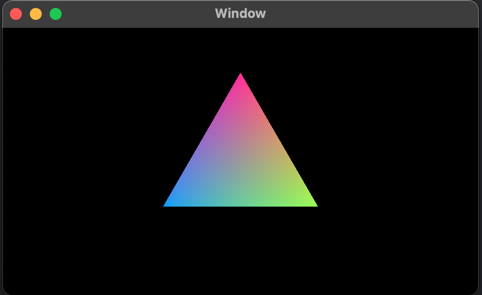
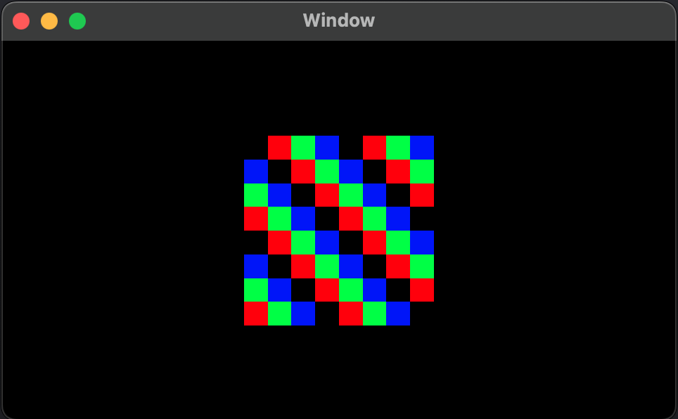

# lib-ixtli-render

Ixtli ("face" in Nahuatl) is a C library for cross-platform rendering on Mac, iOS, Android, Windows and Web with Metal, Vulkan, DirectX, OpenGL and WebGL.

It offers a pre-shaders style fixed pipeline for simple rendering, and allows custom shaders implementation (including for compute).

# Status

[!IMPORTANT]
This is a work-in-progress project, with core and Metal-API already implemented. Progress/status of features are mentioned below.


# Licence

MIT, see LICENSE file

# Origin

Created by [Marcos Ortega](https://mortegam.com/), this project aims to replace the rendering engine used by him for the last 12 years to build crossplatform visual apps.

# Features

General:

- All objects exists inside a Context, no global objects.
- Contexts allow customization of memory and mutexes management.

Render:

- One or more render slots: multiple render jobs can be queued.
- On-the-fly texture format conversion: when the format is not supported by the API.
- Buffers and textures automatic synchronization: for invalidated memory regions.
- Multiple resources modes: which defines how the cpu-data and gpu-data slots are managed.

Fixed-pipeline:

- Zero, one, two or three textures/materials vertices.

APIs:

 - Metal (implemented)
 - DirectX12 (researched and currently coding)
 - Vulkan (researched and queued for coding)
 - OpenGL/ES (researched and queued for coding)
 - WebGL via WebAssembly (researching)

Other languages:

- Thin glue layers will be implemented in C++ and other languages.

# Demos

Please explore the demos folder for IDE workspaces.

## Common

Create a Context:

```
STScnContextItf ctxItf;
{
    memset(&ctxItf, 0, sizeof(ctxItf));
    //set your custom memory/mutex methods here
    //...
    //use default for others
    ScnContextItf_fillMissingMembers(&ctxItf);
}
ScnContextRef ctx = ScnContext_alloc(&ctxItf);
```

Create the render object:

```
//allocate renderer
ScnRenderRef render = ScnRender_alloc(ctx);

//get API's interface (Metal for Apple)
STScnApiItf apiItf;
ScnApiMetal_getApiItf(&apiItf);

//prepare render
STScnRenderCfg cfg = ScnRender_getDefaultCfg();
//set your custom configuration here
...
//
ScnRender_prepare(render, &apiItf, NULL, &cfg);

//open device
const ScnUI32 ammRenderSlots = 3;
ScnRender_openDevice(render, NULL, ammRenderSlots);
```

Create the framebuffer object, linked to your App's View:

```
//allocate framebuffer object
ScnFramebuffRef framebuff = ScnRender_allocFramebuff(render);

//bind with the App's View
ScnFramebuff_bindToOSView(framebuff, (__bridge void*)metalKitView);
```

## Hello Triangle

With a `ScnRenderRef` and a `ScnFramebuffRef` we can now create a model and a render job:

```
//allocate model
ScnModel2dRef model = ScnRender_allocModel(render);

//add draw commands to model
STScnVertex2DPtr verts
        = ScnModel2d_addDraw( model
                            , ENScnRenderShape_TriangStrip
                            , 3
                            );

//update vertices
const float triangSz = 128.f;
STScnVertex2D *v; float rad;
//
rad         = DEG_2_RAD(90.f);
v           = &verts.ptr[0];
v->x        = triangSz * cosf(rad);
v->y        = triangSz * sinf(rad);
v->color.r  = 255;
v->color.g  = 55;
v->color.b  = 155;
v->color.a  = 255;
//
rad         = DEG_2_RAD(90.f + (360.f / 3.f));
v           = &verts.ptr[1];
v->x        = triangSz * cosf(rad);
v->y        = triangSz * sinf(rad);
v->color.r  = 55;
v->color.g  = 155;
v->color.b  = 255;
v->color.a  = 255;
//
rad         = DEG_2_RAD(90.f + (360.f * 2.f / 3.f));
v           = &verts.ptr[2];
v->x        = triangSz * cosf(rad);
v->y        = triangSz * sinf(rad);
v->color.r  = 155;
v->color.g  = 255;
v->color.b  = 55;
v->color.a  = 255;

```

When you App's View can render:

```
//get an available render slot
ScnRenderJobRef job = ScnRender_allocRenderJob(render);
if(ScnRenderJob_isNull(job)){
    //all render slots are busy
    return;
}

//push framebuffer
ScnRenderJob_framebuffPush(job, framebuff);

//add commands
{
    //calculate the center of the view
    STScnGpuFramebuffProps fbProps = ScnFramebuff_getProps(framebuff);
    STScnNode2dProps mldProps = STScnNode2dProps_Identity;
    mldProps.tform.tx = fbProps.viewport.width / 2.f;
    mldProps.tform.ty = fbProps.viewport.height / 2.f;
    
    //add model with the calculated properties
    ScnRenderJob_model2dAddWithNodeProps(job, model, mldProps);
}

//pop framebuffer
ScnRenderJob_framebuffPop(job);

//enqueue job
ScnRender_enqueue(render, job);

//release job
ScnRenderJob_releaseAndNull(&job);
```




## Hello Texture

Please explore the demos folder for IDE workspaces.



## Nica Bird

Please visit [Nica Bird's page](https://mortegam.com/nicabird/) or download the app; it is free.


## Signit Safe

Please visit [SignitS afe's page](https://mortegam.com/) or download the app; it is free.


# Contact

Visit [mortegam.com](https://mortegam.com/) for more information and visual examples of projects built with this libray.

May you be surrounded by passionate and curious people. :-)